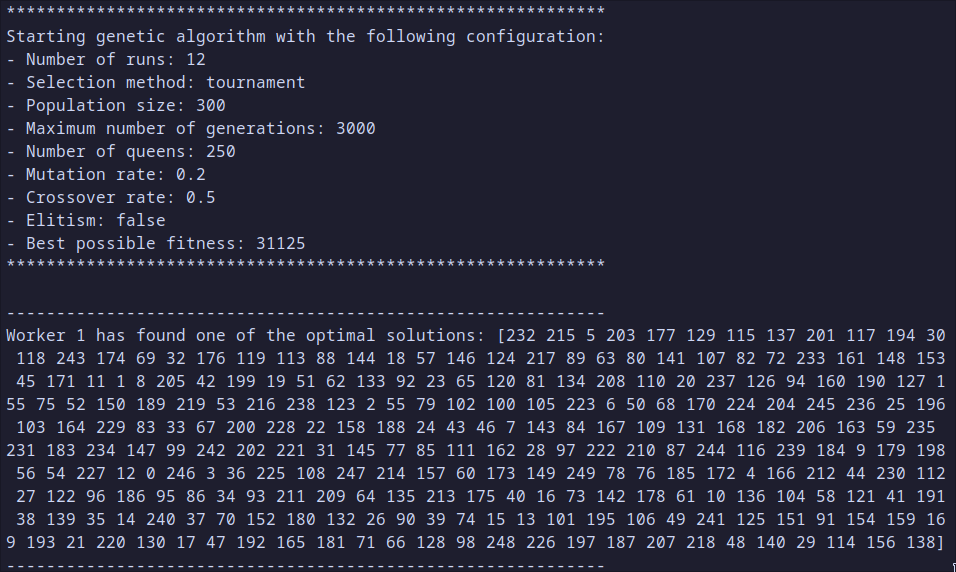

# Genetic N-Queens


## Explicación del problema

El objetivo es posicionar N reinas en un tablero de ajedrez de NxN de tal forma que ninguna reina pueda atacar a otra. Una reina puede atacar a otra si se encuentran en la misma fila, columna o diagonal.

## Espacio de búsqueda

El espacio de búsqueda sería en principio todas las combinaciones posibles de posicionar N reinas en un tablero de NxN. Sin embargo, podemos utilizar permutaciones (solo una reina por fila y columna) para reducir el espacio de búsqueda a N!.

## Representación de la solución

Representaremos las soluciones como una lista de N elementos, donde el índice de cada elemento representa la fila y el valor de cada elemento representa la columna en la que se encuentra la reina.

Ejemplo en un tablero de 4x4:


```
[1, 3, 0, 2]
```

## Función de aptitud

La función de aptitud será la diferencia entre el número máximo posible de pares de reinas no atacantes (num_reinas \* (num_reinas - 1) / 2) y el número de conflictos entre reinas. Al trabajar con permutaciones, solo necesitamos comprobar si las reinas están en la misma diagonal.

```python
def get_num_clashes(individual: list[int]) -> int:
    num_queens = len(individual)
    clashes = 0
    for col1 in range(num_queens):
        for col2 in range(col1 + 1, num_queens):
            row1 = individual[col1]
            row2 = individual[col2]
            # Comprobamos si las reinas están en la misma diagonal
            if row1 - col1 == row2 - col2 or row1 + col1 == row2 + col2:
                clashes += 1
    return clashes

def fitness(individual: list[int]) -> int:
    num_queens = len(individual)
    max_non_attacking_pairs = num_queens * (num_queens - 1) / 2
    clashes = get_num_clashes(individual)
    fitness = max_non_attacking_pairs - clashes
    return fitness
```

## Operadores

Durante el desarrollo de la solución probé diferentes operadores de selección, cruce y mutación.

Al principio, utilicé cruce en un punto y mutación por cambio de bit. Sin embargo, los resultados dejaron mucho que desear. Tras investigar un poco, descubrí que debía utilizar operadores de mutación y cruce específicos para problemas de permutaciones.

A continuación, se detallan los operadores que mejor resultado dieron.

### Selección: Torneo

El mejor resultado se obtuvo con un torneo de 3 individuos.

```python
def tournament_selection(population: list[list[int]], fitnesses: list[int], tournament_size: int) -> list[int]:
    selected = []
    while len(selected) < len(population):
        tournament = random.sample(range(len(population)), tournament_size)
        winner = tournament[0]
        for i in tournament[1:]:
            if fitnesses[i] > fitnesses[winner]:
                winner = i
        selected.append(population[winner])

    return selected
```

### Cruce: Order Crossover (OX)

```python
def order_crossover(parent1: list[int], parent2: list[int]) -> tuple[list[int], list[int]]:
    num_queens = len(parent1)

    # Generamos los puntos de corte
    point1 = random.randint(0, num_queens)
    point2 = random.randint(0, num_queens - 1)
    if point2 >= point1:
        point2 += 1
    else:
        point1, point2 = point2, point1

    # Rellenamos los hijos con -1 para saber qué posiciones faltan por rellenar
    child1 = [-1] * num_queens
    child2 = [-1] * num_queens

    # Copiamos la sección de los padres a los hijos
    for i in range(start, end + 1):
        child1[i] = parent1[i]
        child2[i] = parent2[i]

    # Rellenamos las posiciones restantes del hijo 1
    for i in range(num_queens):
        if parent2[i] not in child1:
            for j in range(num_queens):
                if child1[j] == -1:
                    child1[j] = parent2[i]
                    break

    # Rellenamos las posiciones restantes del hijo 2
    for i in range(num_queens):
        if parent1[i] not in child2:
            for j in range(num_queens):
                if child2[j] == -1:
                    child2[j] = parent1[i]
                    break

    return child1, child2
```

### Mutación: Shuffle Indexes Mutation

```python
def shuffle_indexes_mutation(individual: list[int], individual_mutation_rate: float) -> None:
    num_queens = len(individual)
    for i in range(num_queens):
        if random.random() < individual_mutation_rate:
            swap_index = random.randint(0, num_queens - 1)
            if swap_index >= i:
                swap_index += 1
            individual[i], individual[swap_index] = individual[swap_index], individual[i]
```

## Implementación

### Python

- Utiliza la biblioteca DEAP.
- El código se encuentra en la carpeta `deap_implementation`.
- Se puede ejecutar directamente con el comando `python -m deap_implementation` tras instalar las dependencias con `pip install -r deap-implementation-requirements.txt`.
- Se puede ajustar el algoritmo con parámetros de línea de comandos. Consulta las opciones con `python -m deap_implementation -h`.

### Go

- El código se encuentra en la carpeta `go-implementation`.
- Se puede ejecutar con el comando `make run` tras instalar Go o utilizando los binarios precompilados para Windows, Linux o macOS.
- Se puede ajustar el algoritmo con los mismos parámetros que en la implementación de Python. Consulta las opciones con `./binario -h`.

## GUI

Se puede ejecutar el programa con una interfaz gráfica en Python con el comando `python app.py` y elegir tanto los parámetros del algoritmo genético como la implementación a utilizar. Es recomendable haber compilado los binarios de Go y tenerlos almacenados en la carpeta `go-implementation/bin`.

## Configuración recomendada

### Número de ejecuciones

**12**. Ambas implementaciones se ejecutan concurrentemente utilizando hilos. En mi caso, como mi CPU tiene 12 hilos utilizo 12 ejecuciones para aprovechar al máximo la CPU.

### Tamaño de la población

**300**. Se eligió este tamaño aunque sea bastante grande porque los problemas de permutaciones se benefician de tamaños de población grandes porque nos acercan a la solución desde la primera generación.

### N.º de generaciones

**3000**. Se eligió este número de generaciones porque se observó que el algoritmo convergía en torno a las 2000-3000 generaciones para la implementación de Go (algo pero que la implementación de Python pero generalmente más rápida).

### N.º de reinas

**N**. El algoritmo funciona bien hasta 150-300 reinas, a partir de ahí se vuelve muy lento.

### Probabilidad de cruce

**50%**. Se puede alterar en un rango de un 10% sin notar grandes diferencias.

### Probabilidad de mutación global

**20%**. Valores significativamente más altos o bajos provocan que el algoritmo no llegue a la solución óptima en muchas situaciones.

### Probabilidad de mutación individual

**2/N**. Calculada automáticamente en ambas implementaciones. Es la que mejor resultado dio al escalar el número de reinas.

### Elitismo

**No**. Los resultados con y sin elitismo no tenían diferencias significativas por la naturaleza permutacional del problema. Se decidió no utilizarlo para ahorrar tiempo de ejecución.

### Método de selección

**Torneo de 3 individuos**. Se probó con otros tamaños de torneo y con selección por ruleta, pero el torneo de 3 individuos fue el que mejor resultado dio por el gran tamaño de la población.

## Resultados

A continuación se presentan algunas de las soluciones obtenidas con la configuración recomendada.

### 8 reinas


### 29 reinas


### 100 reinas


### 300 reinas

No mostramos el tablero porque es imposible visualizarlo, pero se obtuvo la solución óptima.



## Webgrafía

- [Explicación del problema de las N reinas.](https://en.wikipedia.org/wiki/Eight_queens_puzzle)
- [Documentación de DEAP.](https://deap.readthedocs.io/en/master/)
- [Casos de uso de los diferentes operadores de cruzamiento.](<https://en.wikipedia.org/wiki/Crossover_(genetic_algorithm)>)
- [Explicación de Ordered Crossover (OX).](https://mat.uab.cat/~alseda/MasterOpt/GeneticOperations.pdf)
- [Casos de uso de los diferentes operadores de mutación.](<https://en.wikipedia.org/wiki/Mutation_(genetic_algorithm)>)
